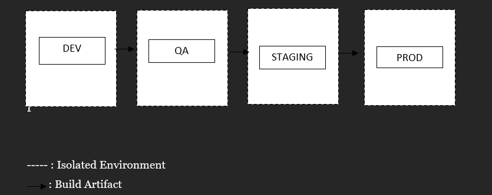

# Recommendation for Application Environments (how many and why?) and how are they going to be separated ?

My recommendations for the application environments are as follows:

---
### a. Development Environment (Dev)
The development environment is the initial deployment stage following code build and preliminary testing. It serves as a sandbox for experimentation, allowing developers to verify that the application aligns with business requirements before advancing to the QA team.

### b. Quality Assurance Environment (QA)
The QA environment is dedicated to conducting functional, regression, load, and security testing on the application. This phase ensures that the application meets business requirements, preserves existing feature functionality, and is free from security vulnerabilities that could impact users or the business.

### c. Staging Environment (Staging)
The staging environment is a controlled setting designed to closely replicate the production environment. It is used for piloting changes, conducting smoke tests, performance evaluations, and user acceptance testing (UAT) on the application.

### d. Production Environment (Prod)
The production environment is the live setting where end-users or clients access the application. It is the final deployment stage and must ensure optimal performance and security.

## Isolation

All four environments must be completely isolated from one another, with dedicated servers, network resources, and other infrastructure components. This segregation is critical to maintain integrity and prevent accidental data leaks between environments.

### Example of Isolations:
- **Network Segmentation:** Utilize distinct subnets or VLANs for each environment to enhance security and control.
- **Access Controls:** Implement stringent access restrictions between environments.
- **Dedicated Resources:** Ensure each environment possesses its own servers, databases, and storage solutions.
- **Secret Management:** Maintain isolated secrets (e.g., API keys, passwords) for each environment to safeguard sensitive information, such as using separate vaults for each environment.
